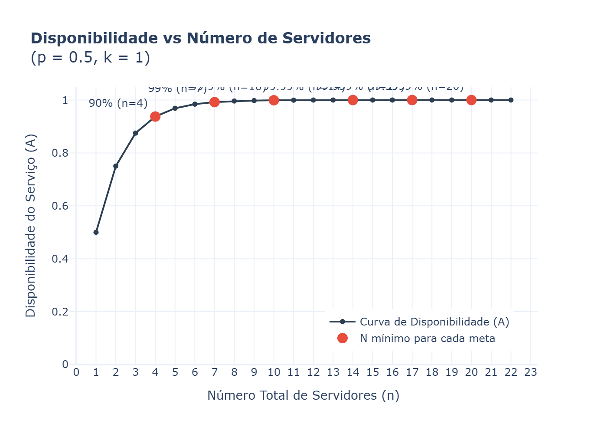
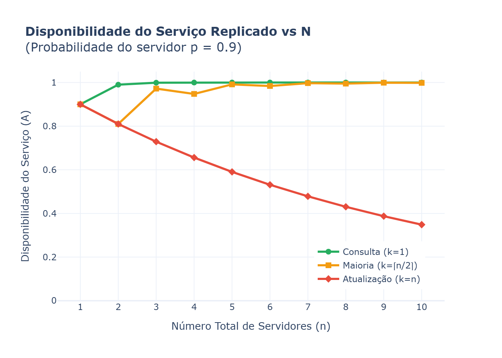

# Disponibilidade de Serviços Replicados

Este repositório contém exercícios e demonstrações de conceitos de Sistemas Distribuídos, focando no estudo de como a replicação afeta a disponibilidade de um serviço.

## 1. Introdução

Em sistemas distribuídos, a falha de componentes é inevitável. Um servidor isolado tem uma probabilidade $p$ de estar funcionando corretamente e disponível para atender requisições. Para aumentar a confiabilidade e garantir que o serviço como um todo continue respondendo mesmo quando algumas máquinas falham, utilizamos a **replicação de servidores**.

Ao manter múltiplas cópias do serviço rodando em servidores diferentes, o sistema ganha tolerância a falhas. A disponibilidade do serviço replicado passa a ser muito maior do que a disponibilidade de uma máquina individual, dependendo das regras de como as operações de leitura e escrita são processadas por esse conjunto de servidores (o chamado quórum).

## 2. Definição do Problema

Para analisar matematicamente a disponibilidade, definimos os seguintes parâmetros para o nosso modelo:

- **$n$**: O número total de servidores que compõem o serviço replicado ($n > 0$).
- **$k$**: O número mínimo de servidores que precisam estar disponíveis para que o serviço como um todo seja considerado funcional ($0 < k \leq n$). Esse valor depende do tipo de operação (ex: para uma leitura simples, pode bastar ler de 1 servidor; para uma escrita consistente, pode ser necessário escrever em todos).
- **$p$**: A probabilidade individual de cada um dos $n$ servidores estar disponível em um dado instante ($0 \leq p \leq 1$). Assumimos que as falhas dos servidores são eventos independentes.

## 3. Fórmula Matemática

A disponibilidade total do serviço, denotada por $A(n, k, p)$, é a probabilidade de que pelo menos $k$ dos $n$ servidores estejam ativos simultaneamente. 

Isso é modelado pela **Distribuição Binomial**, que calcula a probabilidade de obtermos exatamente $i$ sucessos (servidores disponíveis) em $n$ tentativas, onde a probabilidade de sucesso em cada tentativa é $p$. 

Somamos as probabilidades para todos os casos em que o número de servidores vivos ($i$) é maior ou igual ao mínimo exigido ($k$):

$$ A(n,k,p) = \sum_{i=k}^{n} \binom{n}{i} \cdot p^i \cdot (1-p)^{n-i} $$

Onde:
- $\binom{n}{i} = \frac{n!}{i!(n-i)!}$ são as combinações possíveis de escolher $i$ servidores entre $n$.
- $p^i$ é a probabilidade de $i$ servidores estarem disponíveis.
- $(1-p)^{n-i}$ é a probabilidade dos $n-i$ servidores restantes estarem indisponíveis.

## 4. Casos Extremos

Dependendo do protocolo utilizado (\textit{read-one/write-all}, por exemplo), temos diferentes exigências de quórum ($k$). Podemos avaliar a fórmula para dois cenários opostos:

### Consulta (k = 1)
Para ler um dado que está perfeitamente replicado, basta conseguir contato com **pelo menos um** servidor. Ou seja, o serviço só fica indisponível se **todos** os $n$ servidores falharem simultaneamente.

A probabilidade de um servidor falhar é $(1-p)$. A probabilidade de todos falharem juntos é $(1-p)^n$.
Portanto, a disponibilidade é o complementar disso (a probabilidade de não ser o caso de todos falharem):

$$ A_{consulta} = 1 - (1-p)^n $$

*Intuição: A disponibilidade da consulta cresce muito rápido conforme adicionamos servidores. É muito fácil garantir alta disponibilidade para leituras.*

### Atualização (k = n)
Se utilizarmos a abordagem \textit{write-all} (escrever em todos), para atualizar um dado, precisamos conseguir contato com **todos os $n$ servidores**. Se apenas um estiver caído, a operação falha.

$$ A_{atualiza\text{ç}\tilde{a}o} = p^n $$

*Intuição: A disponibilidade da atualização cai rapidamente conforme adicionamos servidores. Quanto mais peças você exige que estejam perfeitas simultaneamente, maior a chance de alguma falhar.*

---

## 5. Experimento Realizado

No arquivo `exercicio1.2.py`, simulamos o caso de uma operação de **Consulta ($k = 1$)**, assumindo um cenário pessimista onde cada servidor é altamente instável e funciona apenas metade do tempo:
- **$p = 0.5$** (50% de disponibilidade individual)

Desejamos calcular quantos servidores ($n$) são necessários para atingir diferentes alvos de alta disponibilidade, listados abaixo. O script busca o menor valor de $n$ que satisfaça ou ultrapasse o alvo desejado.

### Resultados Obtidos:

| Alvo de Disponibilidade | Servidores Exigidos ($n$) | Disponibilidade Real Atingida |
| :---------------------- | :-----------------------: | :---------------------------: |
| 90%                     | 4                         | 93.750000%                    |
| 99%                     | 7                         | 99.218750%                    |
| 99.9%                   | 10                        | 99.902344%                    |
| 99.99%                  | 14                        | 99.993896%                    |
| 99.999%                 | 17                        | 99.999237%                    |
| 99.9999%                | 20                        | 99.999905%                    |

*Essa tabela demonstra a resiliência absurda da replicação para operações flexíveis ($k=1$). Mesmo com máquinas que caem o tempo todo ($p=0.5$), um cluster de 20 máquinas garante a mítica disponibilidade dos "seis noves" (99.9999%).*

## 6. Gráficos

O script também plota e salva os gráficos ilustrando esse fenômeno fisicamente.

### Teto de Servidores para Consulta vs Metas
Abaixo vemos o esforço logarítmico necessário para ultrapassar sucessivas camadas de confiabilidade para as operações de consulta ($p=0.5$).



O gráfico acima evidencia o comportamento assintótico:
- A disponibilidade cresce rapidamente nos primeiros servidores. Ex: passar de 1 para 4 servidores nos leva de 50% para quase 94%.
- Os "noves" seguintes exigem retornos decrescentes. Sair de quase 100% (99.9%) para 99.99% exige 4 servidores a mais, um custo que se acumula no topo para refinar as minúsculas porcentagens de erro restantes.

### Impacto de Diferentes Valores de $k$
Como bônus, exploramos no script do `exercicio1.1.py` as curvas com base na probabilidade teórica com $p=0.9$:


*(Dependendo seu ambiente você precisa executar `exercicio1.1.py` localmente para exportar esta visão. Acima demonstra o rápido declínio da linha de Atualização frente ao disparo de estabilidade em Leituras).*

## 7. Como Executar o Projeto

Você precisará de Python e das bibliotecas Plotly e Kaleido. Recomendamos usar um ambiente virtual (`venv`).

1. **Instale as dependências suportadas para visualização do gráfico.**  
   Note que, para exportar as pranchas em formato de imagem estática (`.png`), será necessário instalar o `kaleido`. Do contrário, os links abrirão no modo browser nativo (`.html`).

   ```bash
   pip install plotly kaleido
   ```
*(Nota ao usuário dos exemplos anteriores: trocamos Matplotlib por Plotly a pedido).*


2. **Execute as simulações base com distribuição binomial (Ex1.1):**
    ```bash
    python exercicio1.1.py
    ```

3. **Gere as estimativas do N mínimo necessário para as metas (Ex1.2):**
    ```bash
    python exercicio1.2.py
    ```

## 8. Conclusão

Analisando as curvas da distribuição binomial para diferentes instâncias de acesso num sistema isolado, chegamos aos seguintes \textit{insights} cruciais:

1. **Replicação aumenta radicalmente a disponibilidade basal** — Especialmente para o resgate de \textit{status} de leitura, mesmo adicionando hardware muito não confiável ($p=0.5$) em quantidade pode produzir um ecossistema indestrutível contra cortes de rede comuns.
2. **Leituras são brutalmente mais tolerantes a falhas que escrita forte** — Requerer apenas que a minoria do quórum de instâncias (ex $k=1$) atenda é muito fácil. Requisições estritas de consistência (ex $k=n$) viram o calcanhar de aquiles do cluster – a chance do ecossistema estar inoperante aumenta exponencialmente a _cada_ servidor somado.
3. **Alto Nível de disponibilidade custa caro** — Adicionar "noves" sequencialmente custa servidores que ficarão ociosos na maior parte do tempo ativo se sua resiliência $p$ primária não for otimizada. A engenharia paralela deve buscar o equilíbrio entre investir na infra (aumentar $p$ na base com melhores servidores) ou cobrir buracos com massa de hardware (\textit{scale-out} horizontal expandindo $n$).